# Оценки разработчиков против реальности

**Что 80 000 задач из трёх независимых источников говорят о точности оценок трудозатрат — и может ли ML предсказать факт лучше, чем сам разработчик**

---

## Кратко

Проанализировано **80 709 задач**, для каждой из которых известны и оценка, и фактические трудозатраты. Шесть выводов:

1. **34 % «идеально точных» оценок в основном датасете — учётный артефакт, а не точность.** Их обязательно надо изолировать до любого моделирования, иначе метрики врут.
2. **Смещение оценки зависит от размера задачи и меняет знак:** мелкие задачи недооценены (×1.22), крупные переоценены (×0.37). Размах — 3.3 раза.
3. **Эффект воспроизводится на всех трёх датасетах** — разные индустрии, культуры и единицы измерения (часы, минуты, помидоры).
4. **Личность исполнителя объясняет почти ничего** (R² = 0.032) — втрое меньше, чем размер задачи (R² = 0.089). Все структурные факторы вместе — менее 15 % дисперсии.
5. **ML не улучшает медианный прогноз, но на 7.3 % снижает RMSE в логарифмах** — то есть выигрывает именно на задачах, которые уезжают в разы.
6. **Правильный продукт модели — не число, а калиброванный интервал.** Conformal-калибровка поднимает покрытие с 68 % до 80.5 %.

---

## 1. Данные и метод

### Источники

| Датасет | Задач | Единицы | Период | Что это |
|---|---:|---|---|---|
| [**SiP**](https://github.com/Derek-Jones/SiP_dataset) | 10 266 | часы | 2004–2014 | Коммерческая компания, 22 разработчика, 20 проектов. Основной. |
| **CESAW** | 60 284 | минуты | 2008–2017 | 247 человек, 45 проектов, формальный TSP-процесс. |
| **Renzo Pomodoro** | 10 159 | помидоры | 2009–2019 | Один человек, 10 лет личного трекинга. |

Все три собраны Дереком Джонсом в [Software-estimation-datasets](https://github.com/Derek-Jones/Software-estimation-datasets).

### Почему всё в логарифмах

Отношение `факт / оценка` строго положительно и сильно скошено. Работа в логарифмах — не косметика, а необходимость:

* ошибки «в 2 раза дольше» и «в 2 раза быстрее» становятся симметричными (`+ln 2` и `−ln 2`);
* среднее лог-отношения = логарифм **геометрического** среднего — устойчивая мера смещения, не сносимая единичными выбросами в 2 490 часов;
* `MAE` в логах читается напрямую: `exp(MAE_log)` = «типичная ошибка в N раз».

### Первая находка — в самих данных

В `Sip-task-info.csv` **12 299 строк, но 10 266 уникальных задач**. Задача, над которой работали несколько человек, записана несколькими строками, и `HoursEstimate` / `HoursActual` в них **продублированы** — это тоталы по задаче, а не по человеку (проверено: `sum(DeveloperHoursActual) == HoursActual` для 100 % задач).

Без дедупликации крупные многолюдные задачи получают вес ×2–×5, и любая «средняя точность» смещается. В моём первом прогоне это давало отличие смещения на мелких задачах в 1.3 раза.

---

## 2. Ловушка, которую надо снять до моделирования

**У 34 % задач SiP факт в точности равен оценке.** В Renzo — 44 %, в CESAW (где учёт автоматизирован) — только 8 %.

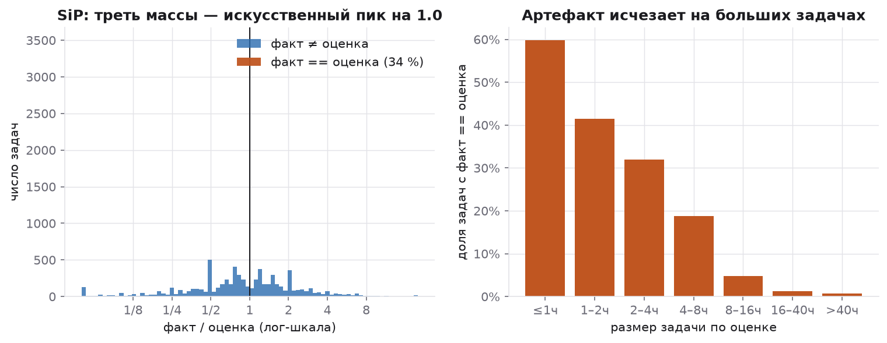

Это не идеальные оценки. Доля точных совпадений падает с **60 % на задачах ≤ 1 часа до 0.8 % на задачах > 40 часов**: списать время «по оценке» легко, когда задача на час, и невозможно, когда она на две недели. Это учётная практика — списание по плану вместо измерения.

Последствия:

* дашборд «наша точность оценок» на треть состоит из тождества и хвалит команду за то, чего нет;
* ML-модель получает треть бесплатных попаданий и выглядит лучше, чем она есть;
* baseline «поверь оценке» получает ту же фору — и становится почти непобедимым по медианным метрикам.

**Поэтому весь анализ ниже дублируется на подвыборке без точных совпадений.** Это главное методологическое решение всей работы.

---

## 3. Оценки — это якоря, а не измерения

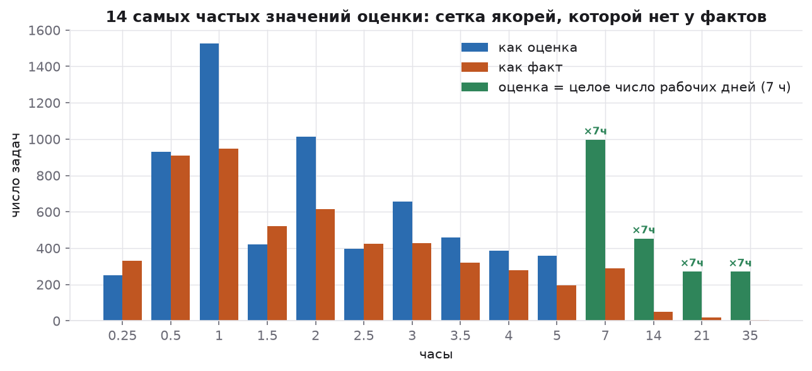

| | оценки | факты |
|---|---:|---:|
| уникальных значений | **142** | 1 245 |
| топ-10 значений покрывают | **70.5 %** | 49.4 % |
| кратно 7 ч (рабочий день) | **21.8 %** | 4.0 % |
| кратно 0.5 ч | 91.2 % | 64.4 % |

Числа 7 / 14 / 21 / 35 выдают семичасовой рабочий день: **каждая пятая оценка — целое число рабочих дней**, среди фактов таких 4 %. Разработчик отвечает не на вопрос «сколько это займёт», а на вопрос «сколько это дней».

---

## 4. Главный эффект: регрессия к среднему

Агрегированное смещение выглядит скромно — геометрическое среднее `факт/оценка` = 0.905 по всем задачам SiP. Соблазнительно заключить «команда оценивает хорошо». Неверно: среднее скрывает **смену знака**.

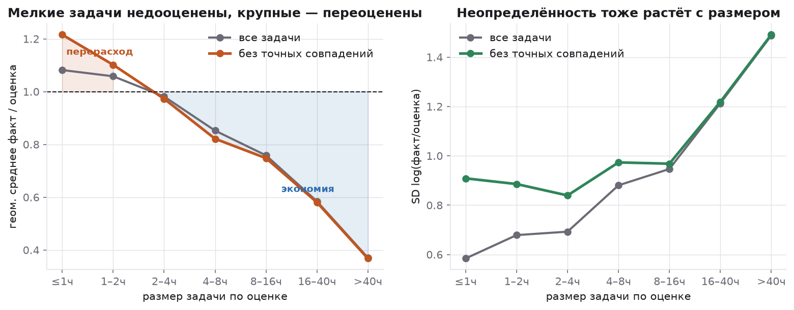

Без точных совпадений (там, где факт действительно измерялся):

| размер задачи | геом. среднее факт/оценка | доля перерасхода | SD лог |
|---|---:|---:|---:|
| ≤ 1 ч | **×1.22** | 55 % | 0.91 |
| 1–2 ч | ×1.10 | 52 % | 0.89 |
| 2–4 ч | ×0.97 | 49 % | 0.84 |
| 4–8 ч | ×0.82 | 45 % | 0.97 |
| 8–16 ч | ×0.75 | 38 % | 0.97 |
| 16–40 ч | ×0.58 | 35 % | 1.22 |
| > 40 ч | **×0.37** | 27 % | 1.49 |

Размах **3.3 раза**, точка равновесия около 2–4 часов. Оценка — шумный сигнал, и экстремальные оценки в обе стороны систематически «тянутся» к типичной длительности задачи.

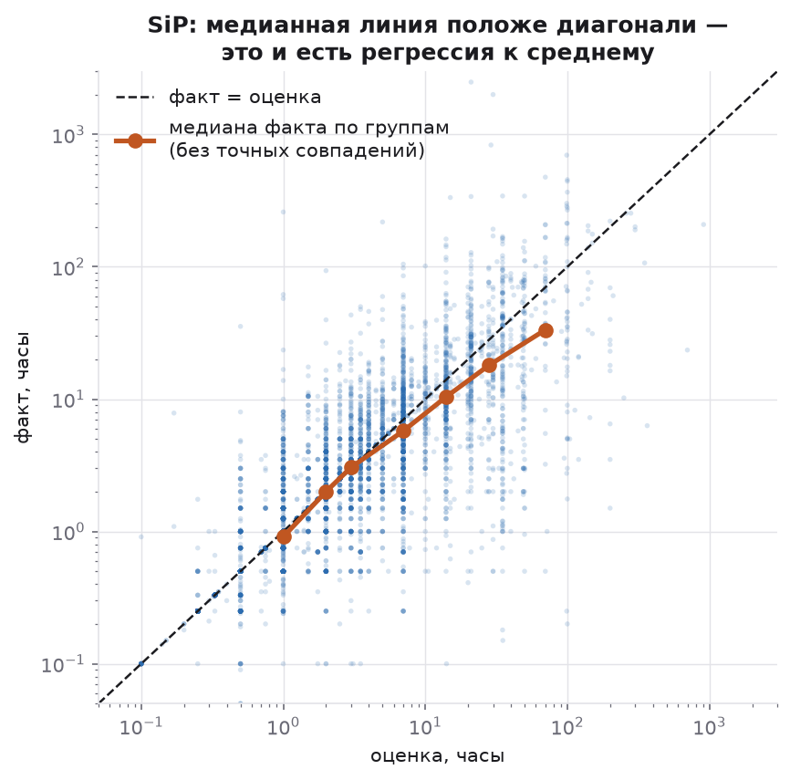

Медианная линия положе диагонали — это и есть регрессия к среднему в чистом виде.

**Практический вывод противоположен фольклору «умножай на два»: умножать надо мелкие задачи, а крупные — делить.** Единый коэффициент запаса на команду вреден вдвойне: он одновременно слишком мал для мелких задач и слишком велик для крупных.

Второй эффект не менее важен: **разброс растёт вместе с размером** (SD лог-отношения 0.91 → 1.49). Для задачи в неделю 90 %-й интервал занимает примерно от ×0.09 до ×11.

### Воспроизводится ли это?

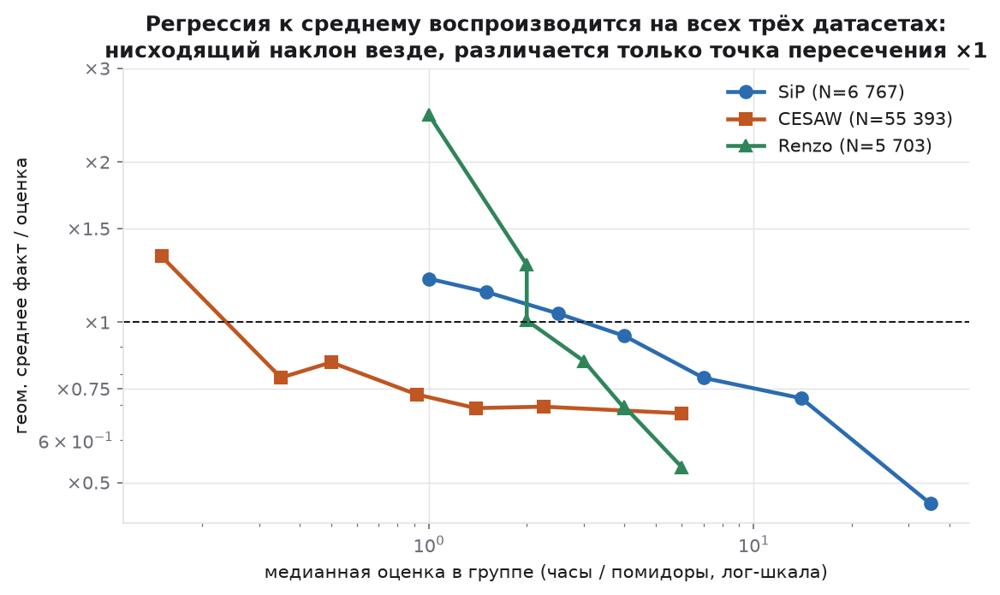

Да, на всех трёх датасетах. Формальная проверка — регрессия `log(факт/оценка) ~ log(оценка)`; отрицательный наклон означает регрессию к среднему:

| датасет | наклон | SE | p-value | N |
|---|---:|---:|---:|---:|
| SiP | −0.240 | 0.009 | 6e−145 | 6 767 |
| CESAW | −0.169 | 0.004 | < 1e−300 | 55 393 |
| Renzo | −0.805 | 0.015 | < 1e−300 | 5 703 |

Различаются абсолютные коэффициенты и точка пересечения ×1 — но **знак и направление одинаковы везде**. У одного человека (Renzo) эффект в 3–5 раз сильнее, чем у организаций: без организационного усреднения регрессия к среднему видна ярче.

---

## 5. Кто «виноват»: люди, проекты или типы задач?

Естественная гипотеза менеджера — «есть оптимисты и есть реалисты, нужны персональные коэффициенты». Проверим, сколько дисперсии лог-отношения объясняет каждый фактор.

| фактор | уровней | R² лог-отношения |
|---|---:|---:|
| **размер задачи** | 7 | **0.089** |
| исполнитель | 21 | 0.032 |
| тип работы | 24 | 0.030 |
| проект | 20 | 0.019 |
| категория | 3 | 0.006 |
| приоритет | 10 | 0.003 |

**Размер задачи объясняет ошибку втрое лучше, чем личность исполнителя — но даже он объясняет всего 9 %.** Все структурные факторы вместе не дотягивают до 15 %. Остальные ~85 % — неопределённость самой задачи, не редуцируемая ни выбором исполнителя, ни классификатором работ.

Отсюда два следствия. Первое: искать «кто у нас плохо оценивает» — оптимизация третьего знака после запятой. Второе, важнее: **если 85 % дисперсии нередуцируемы, любой точечный прогноз обречён, и правильный продукт модели — интервал.**

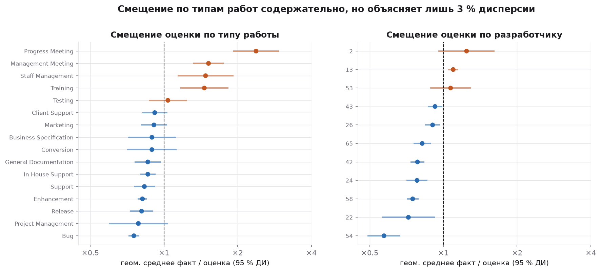

При этом смещение по типам работ, хоть и объясняет мало дисперсии, содержательно осмысленно и статистически устойчиво:

| тип работы | геом. среднее | 95 % ДИ | N |
|---|---:|---|---:|
| Progress Meeting | ×2.38 | 1.91–2.95 | 68 |
| Management Meeting | ×1.52 | 1.32–1.76 | 102 |
| Staff Management | ×1.48 | 1.14–1.92 | 72 |
| Training | ×1.46 | 1.16–1.84 | 155 |
| ... | | | |
| Enhancement | ×0.82 | 0.78–0.85 | 2 007 |
| Bug | ×0.75 | 0.72–0.79 | 1 325 |

Программистские задачи оцениваются с запасом; всё, что связано с людьми и календарём — планёрки, статусные встречи, управление персоналом, обучение — стабильно перерасходуется в 1.5–2.4 раза. Это не «плохие оценщики» — это невидимая коммуникационная работа, которая в оценку просто не попадает.

---

## 6. Учатся ли команды оценивать?

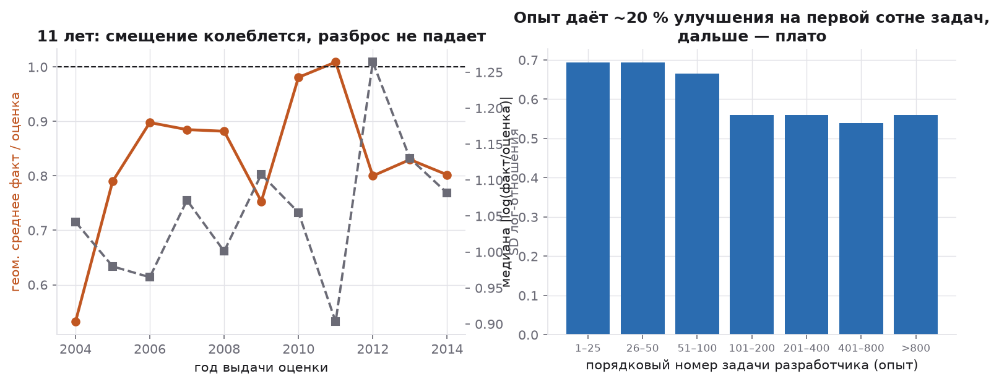

Почти нет.

* **За 11 лет** смещение колеблется в коридоре ×0.75–×1.01 без направленного тренда, а разброс (SD лог-отношения) не снижается вовсе — к концу периода он даже слегка растёт.
* **Индивидуальная кривая опыта** даёт скромный эффект: медиана `|log(факт/оценка)|` падает с 0.69 на первых 25 задачах до 0.56 после сотни и выходит на плато. В переводе: типичная ошибка улучшается с «в 2.0 раза» до «в 1.75 раза» — и на этом обучение заканчивается.

Единственное, что действительно менялось — **дисциплина учёта**: доля точных совпадений упала с 35–40 % в 2005–2008 до 20–22 % в 2013–2014.

---

## 7. Машинное обучение

### Постановка

**Задача:** предсказать `log(факт)` по информации, доступной **в момент выдачи оценки** — сама оценка, проект, тип работы, исполнитель, приоритет, длина формулировки, накопленный опыт исполнителя, календарные признаки (13 признаков).

**Чего в признаках нет:** ничего, что становится известно после начала работы. Поля `DeveloperHoursActual` и `TaskPerformance` — прямые функции от таргета; их включение дало бы R² ≈ 1 и совершенно бессмысленную модель.

**Разбиение — только временное.** Случайный `train_test_split` был бы утечкой: задачи одного проекта и спринта сильно коррелированы. Обучаемся на прошлом, предсказываем будущее — как это работало бы в проде.

**Baseline, который надо побить:** `факт = оценка`, то есть «просто поверь разработчику». Это не соломенное чучело.

### Результаты

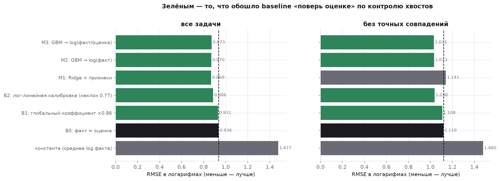

Train: 7 700 задач до 2010-06-21, test: 2 566 задач после.

**На данных «как есть»:**

| модель | MAE_log | типичная ошибка | RMSE_log | MdMRE | PRED(25) |
|---|---:|---|---:|---:|---:|
| константа | 1.145 | ×3.14 | 1.477 | 0.729 | 0.187 |
| **B0: факт = оценка** | **0.554** | **×1.74** | 0.936 | 0.331 | 0.459 |
| B1: глобальный ×0.90 | 0.583 | ×1.79 | 0.931 | 0.290 | 0.470 |
| B2: лог-линейная калибровка | 0.581 | ×1.79 | 0.886 | 0.328 | 0.419 |
| M1: Ridge + признаки | 0.574 | ×1.78 | **0.869** | 0.360 | 0.371 |
| M2: GBM → log(факт) | 0.584 | ×1.79 | 0.870 | 0.376 | 0.386 |
| M3: GBM → log(факт/оценка) | 0.588 | ×1.80 | 0.873 | 0.374 | 0.364 |

**Без точных совпадений:**

| модель | MAE_log | типичная ошибка | RMSE_log | MdMRE | PRED(25) |
|---|---:|---|---:|---:|---:|
| константа | 1.180 | ×3.25 | 1.480 | 0.760 | 0.125 |
| B0: факт = оценка | 0.788 | ×2.20 | 1.119 | 0.500 | 0.228 |
| B1: глобальный ×0.86 | 0.787 | ×2.20 | 1.108 | 0.511 | 0.234 |
| B2: лог-линейная калибровка | 0.772 | ×2.17 | 1.038 | 0.528 | 0.207 |
| M1: Ridge + признаки | 0.806 | ×2.24 | 1.141 | 0.527 | 0.238 |
| M2: GBM → log(факт) | 0.765 | ×2.15 | 1.033 | 0.555 | 0.235 |
| **M3: GBM → log(факт/оценка)** | **0.762** | **×2.14** | **1.031** | 0.545 | 0.226 |

**Как это читать.** На полной выборке baseline не побеждается по медианным метрикам — прямое следствие ловушки из раздела 2: треть тестовых строк тождественны, baseline берёт их с нулевой ошибкой, а любая модель, которая хоть немного сдвигает прогноз, их портит.

Правильный вывод — не «ML не работает», а **«метрика измеряет учётную практику, а не предсказательную способность»**. На честной подвыборке GBM выигрывает и по `MAE_log`, и особенно по `RMSE_log` — то есть **выигрыш идёт в хвостах**, на задачах, которые реально срываются.

### Устойчивость: rolling-origin валидация

Один временной сплит легко даёт случайный результат. Пять последовательных окон, обучение на всём прошлом:

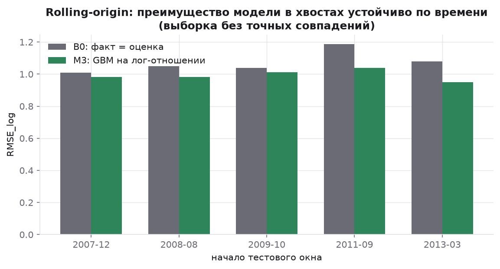

| фолд | тест с | B0 RMSE_log | M3 RMSE_log | выигрыш |
|---|---|---:|---:|---:|
| 1 | 2007-12 | 1.010 | 0.982 | 2.8 % |
| 2 | 2008-08 | 1.049 | 0.981 | 6.5 % |
| 3 | 2009-10 | 1.038 | 1.011 | 2.6 % |
| 4 | 2011-09 | 1.186 | 1.039 | 12.4 % |
| 5 | 2013-03 | 1.079 | 0.949 | 12.0 % |

**Модель выигрывает во всех пяти окнах, в среднем 7.3 %.** Направление устойчиво; величина растёт со временем — вероятно, вместе с объёмом обучающих данных.

### На что модель смотрит

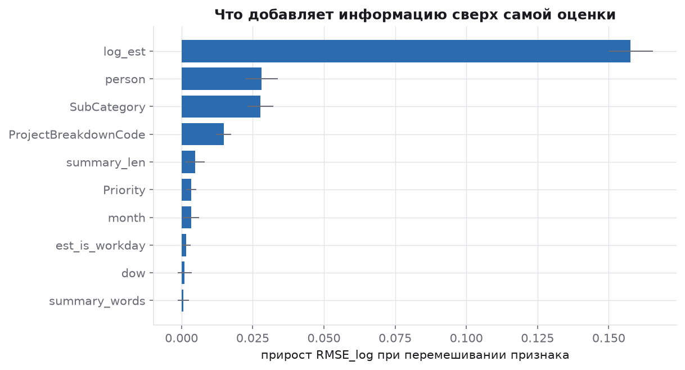

Permutation importance (прирост RMSE_log при перемешивании признака): `log_est` — 0.158, исполнитель — 0.028, тип работы — 0.028, подпроект — 0.015, длина формулировки — 0.005. Остальное — шум. `dev_seq` (опыт) даёт отрицательный вклад, что согласуется с разделом 6: опыт не информативен.

Показательно, что **длина текста задачи попала в топ-5** — сигнал, что эмбеддинги `Summary` дадут больше.

---

## 8. Главный практический результат: интервал вместо числа

Точечный прогноз для задачи с разбросом ×0.5…×3 бесполезен независимо от того, кто его дал — человек или бустинг. Полезен **честный интервал**.

Метод: квантильная регрессия (GBM с pinball loss на 10 % и 90 % квантили лог-отношения) + **conformalized quantile regression (CQR)**. Календарно последние 20 % обучающей выборки отрезаются как calibration set, на нём считается conformity score `s = max(lo − y, y − hi)`, и интервал расширяется на его эмпирический квантиль.

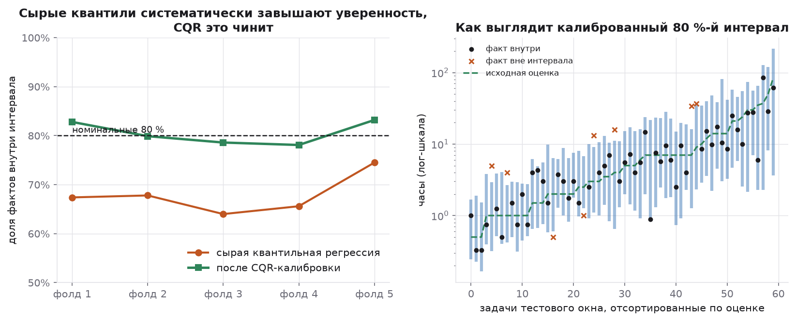

| | покрытие | медианная ширина |
|---|---:|---:|
| сырая квантильная регрессия | **67.9 %** | ×5.3 |
| после CQR-калибровки | **80.5 %** | ×9.5 |

Номинал — 80 %. **Сырая квантильная регрессия систематически самоуверенна** (недобирает 12 пунктов покрытия); conformal-поправка возвращает покрытие к номинальному на каждом из пяти окон (0.78–0.83).

*Проверено и отвергнуто:* асимметричная версия CQR (отдельные поправки на верхнюю и нижнюю границы) даёт то же покрытие 80.4 % при чуть большей ширине (×9.8), поэтому оставлена симметричная.

**Итоговое правило для планирования** — что на самом деле означает оценка разработчика:

| оценка разработчика | честный 80 %-й диапазон | медианная ширина |
|---|---|---:|
| ≤ 1 ч | ×0.44 … ×3.4 | ×8.2 |
| 1–2 ч | ×0.41 … ×3.3 | ×8.4 |
| 2–4 ч | ×0.32 … ×3.2 | ×10.3 |
| 4–8 ч | ×0.25 … ×3.2 | ×13.2 |
| 8–16 ч | ×0.23 … ×3.1 | ×12.7 |
| 16–40 ч | ×0.14 … ×2.4 | ×16.7 |
| > 40 ч | ×0.05 … ×2.6 | ×48.6 |

Интервалы широкие — и это не недостаток модели, а **измеренное свойство предметной области**. Менеджеру полезнее знать реальную ширину, чем получать точное число, в которое никто не попадёт.

---

## 9. Выводы

1. **Сначала проверьте, что вы измеряете.** Доля точных совпадений в разрезе размера задачи — бесплатный тест на здоровье учёта. Если она падает с 60 % до 1 %, вы смотрите на дисциплину списания времени, а не на точность оценок.
2. **Смещение зависит от размера и меняет знак.** Мелкое ×1.22, крупное ×0.37. Единый коэффициент запаса вреден, потому что ошибается в разные стороны на разных задачах.
3. **Персональные коэффициенты оценщика — шум, выданный за сигнал** (R² = 0.032).
4. **Коммуникационная работа систематически не попадает в оценки** (планёрки ×2.38, встречи ×1.52, обучение ×1.46). Самое дешёвое улучшение планирования из всего найденного: закладывать её отдельной строкой, а не «внутри» задач.
5. **Опыт почти не помогает** — ~20 % улучшения на первой сотне задач, дальше плато.
6. **ML улучшает не медиану, а хвост** — 7.3 % по RMSE_log, устойчиво по пяти временным окнам. Это ровно тот вопрос, который нужен менеджеру: *какая из этих задач имеет шанс уехать в разы?*
7. **Отдавайте интервал, а не число.**

### Ограничения

* Выводы наблюдательные: неизвестно, влияла ли оценка на факт (self-fulfilling prophecy — разработчик мог подгонять работу под срок). Разделить это без эксперимента невозможно.
* Незакрытых и отменённых задач в датасетах нет → survivorship bias, вероятно смещающий выводы в оптимистичную сторону.
* SiP — одна компания одной эпохи. CESAW и Renzo подтверждают эффект размера, но не абсолютные коэффициенты.
* Conformal-гарантия требует обменности; процесс нестационарен, поэтому покрытие проверялось эмпирически на каждом окне.

### Что дальше

* Иерархическая байесовская модель: частичный пулинг по разработчику и типу работы вместо шумных групповых средних.
* Эмбеддинги текста `Summary` — длина текста уже в топ-5 по важности.
* Модель цензурированных наблюдений для незакрытых задач (снять survivorship bias).
* Проверка на уровне спринта: агрегируются ли ошибки отдельных задач в ошибку спринта или частично компенсируют друг друга. Для планирования это главный вопрос.

---

## Воспроизведение

```bash
pip install -r requirements.txt
python src/analysis.py          # ~40 секунд, пишет figures/ и results/
```

Или открыть [`notebooks/Dev_Estimations_Analysis.ipynb`](notebooks/Dev_Estimations_Analysis.ipynb) в Google Colab — данные скачиваются автоматически.
